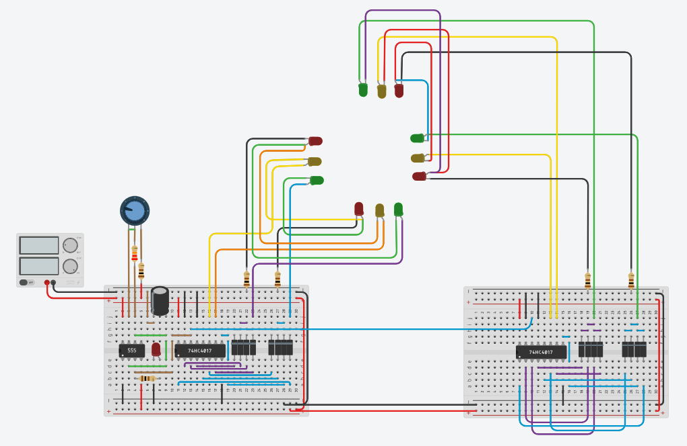

# 🚦 4-Way Traffic Light Control System Without Arduino

> **Course:** Digital Logic & System Design Lab  
> **Course Code:** CSE 210  
> **Semester:** 2.2

---

## 📘 Project Overview

This project demonstrates a simple yet effective **4-way traffic light system** designed using **digital logic ICs**, primarily the **74HC4017 Johnson Decade Counter** and a **555 timer** in astable mode. It cycles through standard traffic light sequences for four directions, simulating a real-world traffic intersection.

---

## 🛠️ Components

-   **ICs Used:** 74HC4017 (x2), 555 Timer
-   **Basic Components:** LEDs, resistors, diodes, capacitors, potentiometer
-   **Power Source:** Breadboard with external DC/battery input
-   **Platform:** Breadboard prototyping (no microcontroller used)

---

## 🖼️ Circuit Diagram

---

## 📂 Files in this Repository

| Path                      | Description                             |
| ------------------------- | --------------------------------------- |
| `circuit.png`             | Main circuit diagram (quick view)       |
| `docs/components.pdf`     | List of all components used             |
| `docs/schematic_view.pdf` | Detailed schematic of the circuit       |
| `images/`                 | Photos and screenshots of the project   |
| `videos/`                 | Demo videos showing the working project |
| `LICENSE`                 | Open-source license                     |
| `README.md`               | Project overview (this file)            |

---

## 📌 Notes

-   This is a **purely hardware-based** digital logic project – no software or programming required.
-   The timing and transition speed can be adjusted using the potentiometer.
-   Designed and tested on a breadboard with real components.

---

## 📄 License

This project is provided for educational purposes and open for public use under the [MIT License](LICENSE).

---
